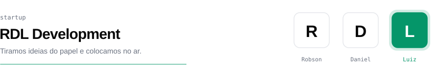

<picture>
  <source media="(prefers-color-scheme: dark)" srcset="./assets/header-dark.svg">
  
</picture>

Desenvolvedor focado em **automação e integrações**: chatbots com IA, integração com APIs e desenvolvimento web e mobile. Formado em **Análise e Desenvolvimento de Sistemas no IFG** e co-fundador da **[RDL Development](https://rdldevelopment.dev)**.

 

### Projeto em destaque

**[Chatbot Coral](https://github.com/LuizHenriqueRO/Chatbot-Coral)** — assistente no WhatsApp que entrega kits de voz, partituras, letras e materiais de estudo para os membros do Coral Jovem da Asa Norte, conversando em linguagem natural e lembrando o contexto da conversa.

<picture>
  <source media="(prefers-color-scheme: dark)" srcset="./assets/coral-dark.svg">
  
</picture>

`Node.js` · `Express` · `WhatsApp Cloud API` · `OpenAI gpt-4o-mini` · `Google Drive API` · `Redis`

 

### Startup

<a href="https://rdldevelopment.dev">
  <picture>
    <source media="(prefers-color-scheme: dark)" srcset="./assets/rdl-dark.svg">
    
  </picture>
</a>

Na **RDL Development** criamos sites, aplicativos e sistemas sob medida, do planejamento à entrega. Eu cuido de **automação e integrações**: chatbots, integração com APIs e desenvolvimento web e mobile.

 

### Outros projetos

| | |
|---|---|
| **[Whatsapp-Bot](https://github.com/LuizHenriqueRO/Whatsapp-Bot)** | Bot de WhatsApp em Node.js: figurinhas, ChatGPT e Gemini, transcrição e tradução de áudio, OCR e downloads. |
| **[Portal de Notícias](https://github.com/LuizHenriqueRO/portal-noticias-laravel)** | Portal de notícias em Laravel com autenticação e gerenciamento de publicações. |

 

### Stack

<picture>
  <source media="(prefers-color-scheme: dark)" srcset="https://skillicons.dev/icons?i=js,nodejs,express,php,laravel,java,c,react,html,css,mysql,postgres,redis,docker,git,gitlab&theme=dark&perline=16">
  
</picture>

**Integrações:** WhatsApp Cloud API · OpenAI API · Google Drive API

 

### Contato

[LinkedIn](https://www.linkedin.com/in/luiz-henrique-rocha-de-oliveira-547655244/) · [Email](mailto:luizrocha1911@gmail.com) · [RDL Development](https://rdldevelopment.dev)

Aberto a oportunidades, projetos freelancer e colaborações em código aberto.
